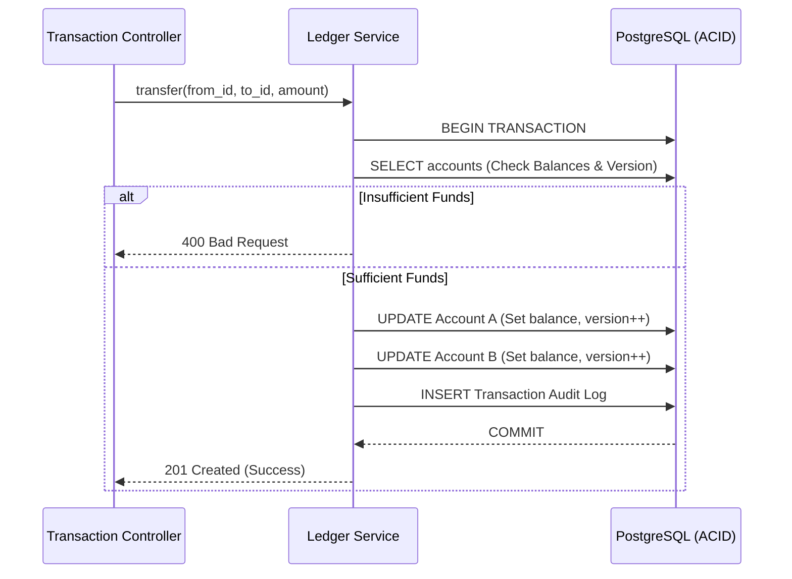

# High-Performance Financial Ledger

[](https://www.oracle.com/java/technologies/downloads/)
[](https://spring.io/projects/spring-boot)
[](https://www.postgresql.org/)

A mission-critical, ACID-compliant ledger engine designed for high-concurrency financial transactions. This system serves as a **Single Source of Truth (SSoT)** for account balances, ensuring 100% data integrity with zero rounding errors.

---

## Overview

In FinTech ecosystems, a ledger must handle thousands of simultaneous transfers without losing a single cent. This project implements a **Double-Entry Style Ledger** with sophisticated locking mechanisms to prevent common distributed systems issues like "Lost Updates" or "Double Spending."

### Key Engineering Pillars
* **Transactional Integrity:** Strict adherence to ACID properties using Spring Transaction Management.
* **Numerical Precision:** Uses `BigDecimal` with `ROUND_HALF_EVEN` (Banker's Rounding) to eliminate floating-point inaccuracies.
* **Optimistic Concurrency Control:** Implements version-based locking to maximize throughput in high-traffic environments.
* **Idempotency:** Designed to handle duplicate transaction requests without duplicate processing.

---

## 🛠️ System Architecture




## Technical Deep Dive

### 1. Handling Race Conditions
When multiple transactions attempt to update the same account balance simultaneously, a **Race Condition** occurs.
* **Solution:** This project implements **Optimistic Locking** using the `@Version` annotation.
* **Result:** Instead of utilizing heavy "Pessimistic" database locks that block other reads, we check the record's version during the update. If the version has changed since it was read, the transaction rolls back safely, preventing data corruption and "Lost Updates."

### 2. Complexity Analysis
| Operation | Time Complexity | Consistency Guarantee |
| :--- | :--- | :--- |
| **Balance Inquiry** | $O(1)$ | Eventual or Strong (Configurable) |
| **Internal Transfer** | $O(1)$ | **Atomic (ACID)** |
| **Audit Log Ingestion** | $O(1)$ | Immutable Append-Only |

---

## Getting Started

### Prerequisites
* **JDK 21+** 
* **Docker Desktop**

### Installation

1. **Clone the Repository**
   ```bash
   git clone [https://github.com/niranjana512/high-performance-ledger.git](https://github.com/niranjana512/high-performance-ledger.git)
   ```
2. **Start Database Infrastructure**
   ```bash
   docker-compose up -d
   ```
3. **Run application**
   ```bash
   ./mvnw spring-boot:run
   ```
